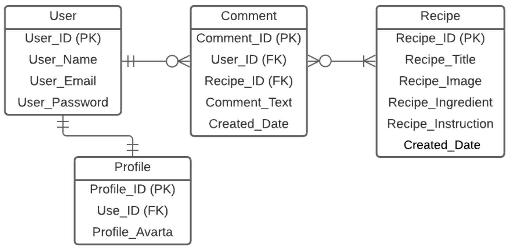

# Project name: Vy's Kitchen

## Project link: 

## Project description:
**Vy's Kitchen** is an web application also mobile friendly about Vietnamese Food Receipes. You can access to tons of receipes from Vietnamese Specialties to Vietnamese streetfoods like Pho, Banh Mi, Bun Bo, Hu tiu Bo kho, Banh trang nuong (Vietnamese Pizza)...You can also save the receipe that you like when you register to the website.

## Technologies used:
- Language: HTML, CSS, JS, Python
- Framework: Django, Materialize
- Database: Postgresql
- Deployment on: Netlify 

## Installation steps:

## User stories:
**User should be able to:**
- See all the latest receipes in homepage.
- Click on Read More to see the receipe detail.
- Sign up a new account.
- Log in if he/she has already registered.
- 
**After login, user should be able to:**
- Be redirected to their public profile page
- Change his/her name
- Change his/her email
- Save the reciepe that he/she likes

## Wireframes:

**Homepage**

**Receipe page**

**About page**

**Profile Page**

## Entity relationship diagram:

## Futute features:
**After login, user shouls be able to:**
- Add comments in the receipe page
- Delete comments in the receipe page
